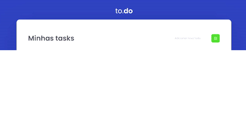

<h1 align="center">
  To-do List
</h1>

- - -

<h1>Preview</h1>

  

 

## Tecnologias

Esse projeto foi desenvolvido com as seguintes tecnologias:

- HTML
- SASS
- REACT 
- TYPESCRIPT

## Projeto

 Esse projeto é um desafio da Rocketseat da trilha de ReactJs, onde o foco dele é exercicitar a parte de estado no React, que foi proposto o desafio uma to-do list que tivemos que adicionar as funcionalidades de adicionar um item a lista, marcá-lo como completo e poder excluí-lo.

- - -

 Template desenvolvido pela Rocketseat como desafio, e funcionalidades no React adicionada pelo Enan Dorta
